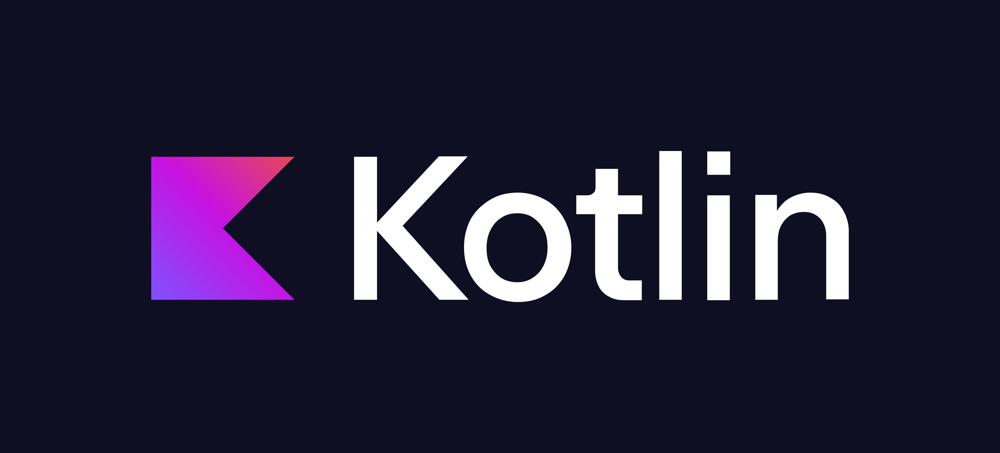

    
    
    

# *Solutions*

## [**Day 01**](https://adventofcode.com/2024/day/1)

    
    
    

## [**Day 02**](https://adventofcode.com/2024/day/2)

    

## [**Day 03**](https://adventofcode.com/2024/day/3)

    

## [**Day 04**](https://adventofcode.com/2024/day/4)

    

## [**Day 05**](https://adventofcode.com/2024/day/5)

    

## [**Day 06**](https://adventofcode.com/2024/day/6)

    

## [**Day 08**](https://adventofcode.com/2024/day/8)

    

## [**Day 09**](https://adventofcode.com/2024/day/9)

    

*More is gonna come soon...*

# Images

# Last Words

***Merry Christmas!***

©️ [Jan "JoubaMety" Rašnovský](https://joubamety.com) 2024, [MIT License](/LICENSE)